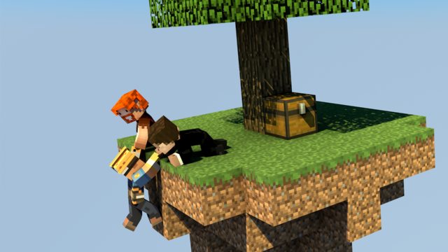

  <section class="usb-home-hero">
    

      
Skyblock for Spigot and Paper

      <h1>uSkyBlock</h1>
      

        Start on a small floating island, build it into something thriving, complete challenges,
        and team up with other players to push your island further.
      

    

    
  </section>

  <section class="usb-home-grid">
    <a class="usb-home-card" href="players/">
      For players
      <h2>Play uSkyBlock</h2>
      
Learn islands, challenges, parties, and the core command flow.

    </a>
    <a class="usb-home-card" href="admin/setup/">
      For admins
      <h2>Run a server</h2>
      
Install the plugin, verify startup, and customize gameplay.

    </a>
    <a class="usb-home-card" href="developers/">
      For developers
      <h2>Build and extend</h2>
      
Build from source, understand the architecture, and use the API.

    </a>
  </section>

  <a class="usb-home-contribute" href="contributing/">
    <strong>Contribute to uSkyBlock</strong>
    Suggest ideas, improve translations, propose challenges, or send code.
  </a>

